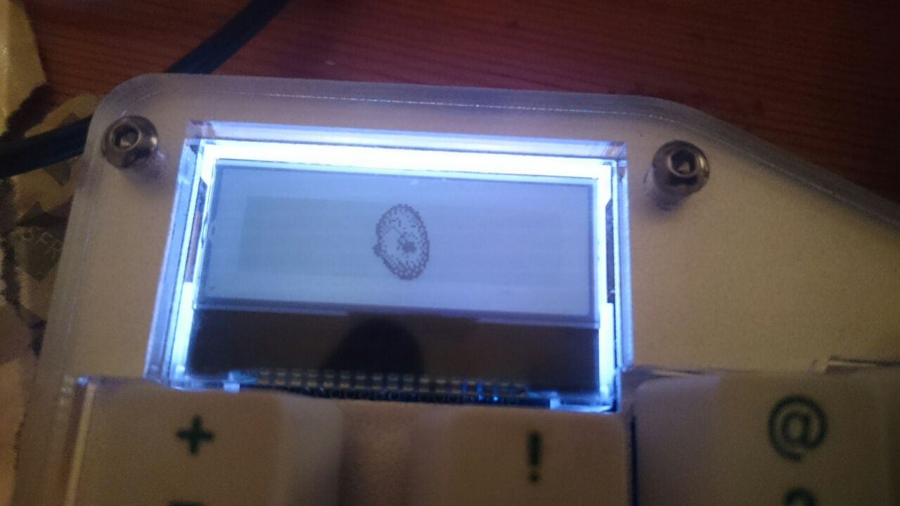
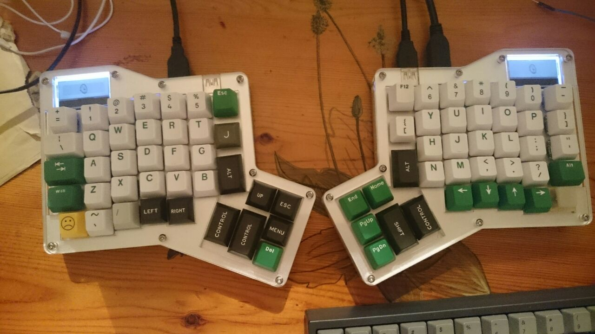

# Dangasm on my ergodox






## How to

> This is not working very well on left hand with the layout switcher switch. But it seems related to my layout!

I love the [emojis](https://twitchemotes.com/channel/dansgaming) of [dansgaming](https://www.twitch.tv/dansgaming) and I love the ergdox. I saw that @tenderlove made a nice custom ergodox logo [with DangerZone logo](https://gist.github.com/tenderlove/193e027b1670af6f9c85) and [Ivan Tam with a 💀](http://asciipr0n.net/ergodox-infinity-logo/). I wanted to make a new one.

I've started with the emoji.


On [pixlr](https://pixlr.com/editor/) I've change it a little bit to this and [export it to bmp](danGasmLcd.bmp) ("128 X 32 pixel dimensions of the LCD display and has a black foreground on a white background" thanks Ivan) :


Then on osx I follow [this guide](https://github.com/kiibohd/controller/wiki/How-To-Load-Layouts-to-Keyboard) until [*Fifth Step: Second Compile - Your Files*](https://github.com/kiibohd/controller/wiki/How-To-Load-Layouts-to-Keyboard#fifth-step-second-compile---your-files).

With python3 : `python3 controller/Scan/STLcd/bitmap2Struct.py path/of/danGasmLcd.bmp`

It will return a big chunck. Copy it and past it into a kll file similiar to [this one](danGasmLcd.kll) :

```
Name = image;
Version = 0.3;
Author = "dangasm";
KLL = 0.3c;

STLcdDefaultImage = "
0x00, 0x00, 0x00, 0x00, 0x00, 0x00, 0x00, 0x00, 0x00, 0x00, 0x00, 0x00, 0x00, 0x00, 0x00, 0x00, 0x00, 0x00, 0x00, 0x00, 0x00, 0x00, 0x00, 0x00, 0x00, 0x00, 0x00, 0x00, 0x00, 0x00, 0x00, 0x00, 0x00, 0x00, 0x00, 0x00, 0x00, 0x00, 0x00, 0x00, 0x00, 0x00, 0x00, 0x00, 0x00, 0x00, 0x00, 0x00, 0x00, 0x00, 0x00, 0x00, 0x00, 0x00, 0x00, 0x00, 0x00, 0xc0, 0xe0, 0x70, 0xb8, 0x5c, 0x34, 0xde, 0x6b, 0x3f, 0xdb, 0x37, 0x9f, 0x7a, 0x2e, 0xfc, 0x58, 0xe0, 0x00, 0x00, 0x00, 0x00, 0x00, 0x00, 0x00, 0x00, 0x00, 0x00, 0x00, 0x00, 0x00, 0x00, 0x00, 0x00, 0x00, 0x00, 0x00, 0x00, 0x00, 0x00, 0x00, 0x00, 0x00, 0x00, 0x00, 0x00, 0x00, 0x00, 0x00, 0x00, 0x00, 0x00, 0x00, 0x00, 0x00, 0x00, 0x00, 0x00, 0x00, 0x00, 0x00, 0x00, 0x00, 0x00, 0x00, 0x00, 0x00, 0x00, 0x00, 0x00, 0x00, 0x00,
0x00, 0x00, 0x00, 0x00, 0x00, 0x00, 0x00, 0x00, 0x00, 0x00, 0x00, 0x00, 0x00, 0x00, 0x00, 0x00, 0x00, 0x00, 0x00, 0x00, 0x00, 0x00, 0x00, 0x00, 0x00, 0x00, 0x00, 0x00, 0x00, 0x00, 0x00, 0x00, 0x00, 0x00, 0x00, 0x00, 0x00, 0x00, 0x00, 0x00, 0x00, 0x00, 0x00, 0x00, 0x00, 0x00, 0x00, 0x00, 0x00, 0x00, 0x00, 0x00, 0x10, 0x3c, 0xfe, 0x7e, 0x8b, 0x2d, 0x02, 0x01, 0x02, 0x00, 0xb1, 0xc0, 0x74, 0xf8, 0xfa, 0xf0, 0xf8, 0x30, 0x81, 0x24, 0xdb, 0xad, 0xff, 0x00, 0x00, 0x00, 0x00, 0x00, 0x00, 0x00, 0x00, 0x00, 0x00, 0x00, 0x00, 0x00, 0x00, 0x00, 0x00, 0x00, 0x00, 0x00, 0x00, 0x00, 0x00, 0x00, 0x00, 0x00, 0x00, 0x00, 0x00, 0x00, 0x00, 0x00, 0x00, 0x00, 0x00, 0x00, 0x00, 0x00, 0x00, 0x00, 0x00, 0x00, 0x00, 0x00, 0x00, 0x00, 0x00, 0x00, 0x00, 0x00, 0x00, 0x00, 0x00, 0x00,
0x00, 0x00, 0x00, 0x00, 0x00, 0x00, 0x00, 0x00, 0x00, 0x00, 0x00, 0x00, 0x00, 0x00, 0x00, 0x00, 0x00, 0x00, 0x00, 0x00, 0x00, 0x00, 0x00, 0x00, 0x00, 0x00, 0x00, 0x00, 0x00, 0x00, 0x00, 0x00, 0x00, 0x00, 0x00, 0x00, 0x00, 0x00, 0x00, 0x00, 0x00, 0x00, 0x00, 0x00, 0x00, 0x00, 0x00, 0x00, 0x00, 0x00, 0x00, 0x00, 0x00, 0x7c, 0xff, 0xab, 0xd4, 0x28, 0x90, 0x20, 0x20, 0x10, 0xc9, 0x06, 0x2e, 0x09, 0x04, 0x48, 0x44, 0x82, 0x70, 0xcd, 0x7a, 0x1f, 0x01, 0x00, 0x00, 0x00, 0x00, 0x00, 0x00, 0x00, 0x00, 0x00, 0x00, 0x00, 0x00, 0x00, 0x00, 0x00, 0x00, 0x00, 0x00, 0x00, 0x00, 0x00, 0x00, 0x00, 0x00, 0x00, 0x00, 0x00, 0x00, 0x00, 0x00, 0x00, 0x00, 0x00, 0x00, 0x00, 0x00, 0x00, 0x00, 0x00, 0x00, 0x00, 0x00, 0x00, 0x00, 0x00, 0x00, 0x00, 0x00, 0x00, 0x00, 0x00, 0x00, 0x00,
0x00, 0x00, 0x00, 0x00, 0x00, 0x00, 0x00, 0x00, 0x00, 0x00, 0x00, 0x00, 0x00, 0x00, 0x00, 0x00, 0x00, 0x00, 0x00, 0x00, 0x00, 0x00, 0x00, 0x00, 0x00, 0x00, 0x00, 0x00, 0x00, 0x00, 0x00, 0x00, 0x00, 0x00, 0x00, 0x00, 0x00, 0x00, 0x00, 0x00, 0x00, 0x00, 0x00, 0x00, 0x00, 0x00, 0x00, 0x00, 0x00, 0x00, 0x00, 0x00, 0x00, 0x00, 0x01, 0x07, 0x0e, 0x1a, 0x3d, 0x61, 0x79, 0xc2, 0xf1, 0x48, 0xf0, 0x64, 0x71, 0x3a, 0x1d, 0x1e, 0x07, 0x01, 0x00, 0x00, 0x00, 0x00, 0x00, 0x00, 0x00, 0x00, 0x00, 0x00, 0x00, 0x00, 0x00, 0x00, 0x00, 0x00, 0x00, 0x00, 0x00, 0x00, 0x00, 0x00, 0x00, 0x00, 0x00, 0x00, 0x00, 0x00, 0x00, 0x00, 0x00, 0x00, 0x00, 0x00, 0x00, 0x00, 0x00, 0x00, 0x00, 0x00, 0x00, 0x00, 0x00, 0x00, 0x00, 0x00, 0x00, 0x00, 0x00, 0x00, 0x00, 0x00, 0x00, 0x00, 0x00, 0x00,
";
```

Save it to the layout folder (`controller/kll/layouts/`) with the other kll you get from [the configurator](http://configurator.input.club/?layout=MDErgo1-Default).

Then you are ready to edit the bash script to compile the files. Go to `controller/Keyboards` and edit a copy of `ergodox.bash`

Add all the KLL (the one of from the configurator) don't forget to add `danGasmLcd` to [the file](ergodox_dangasm.bash).

Run `bash ergodox-copy.bash`

You have now 2 folders `ICED-L` and `ICED-R` run in each one `dfu-util -D kiibohd.dfu.bin` after you put your ergodox in flash mode.

Enjoy!
